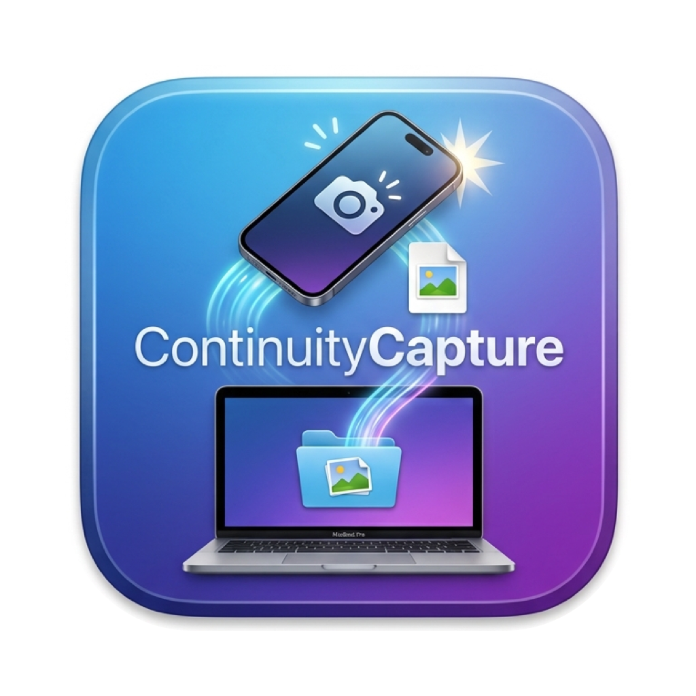

<p align="center">
  
</p>

<h1 align="center">ContinuityCapture</h1>

<p align="center">
  Fire iPhone/iPad <b>Continuity Camera</b> from a hotkey and save photos &amp; scans straight into a folder.<br>
  <i>No Preview window · no iCloud delay · no resident process · no Accessibility permission</i>
</p>

---

Press a hotkey on your Mac → your iPhone's camera opens → shoot → the JPEG lands
in `~/Pictures/from_iphone` about a second later, transferred directly over
Apple's peer-to-peer Wi-Fi (AWDL — the same transport AirDrop uses).

- **Photo** → `~/Pictures/from_iphone/IMG_yyyyMMdd_HHmmss.jpg`
- **Scan** → `~/Pictures/from_iphone/Scan_yyyyMMdd_HHmmss.pdf` (multi-page → one PDF)
- The capture is **also copied to the clipboard** — ⌘V pastes it straight into
  Slack/Notes/KakaoTalk (as image or file attachment) or Finder (as a file).
  One pasteboard item carries both the file reference and raw image/PDF data.
- **Auto-paste into the app you fired the hotkey from**: AI apps and browsers
  (Claude, ChatGPT, Gemini, Safari, Chrome) get the image pasted via ⌘V;
  terminals and IDEs (Ghostty, Terminal, iTerm2, VS Code, Cursor, …) get the
  escaped *file path* — exactly what CLI agents like Claude Code want. Unknown
  apps get clipboard-only, no keystroke injection. Same behavior as
  [AIShot](https://github.com/techjuicelab); disable with `--no-paste`.
- Runs **only while invoked** — exits immediately after saving, cancelling, or timing out
- Needs **no permissions at all**: no Accessibility, no camera/microphone, no UI scripting
- Plays *Glass* on save, *Basso* when no device is available

## Install

**Option A — prebuilt app.** Download `ContinuityCapture.app.zip` from
[Releases](https://github.com/techjuicelab/continuity-capture/releases), unzip
into `~/Applications`. Universal binary (Apple Silicon + Intel), macOS 14+.
Browser downloads are quarantined, so right-click → Open once on first launch.

**Option B — build from source** (requires Xcode Command Line Tools):

```sh
git clone https://github.com/techjuicelab/continuity-capture.git
cd continuity-capture && ./build.sh   # builds, signs, installs to ~/Applications
```

Clone it anywhere — nothing depends on the path or username.

## Usage

```sh
open -na ContinuityCapture --args photo
open -na ContinuityCapture --args scan
```

| Flag | Description | Default |
|---|---|---|
| `photo` / `scan` | take a photo / scan documents | `photo` |
| `--out DIR` | destination folder | `~/Pictures/from_iphone` |
| `--device HINT` | preferred device name substring (falls back to first available) | `iPhone` |
| `--timeout SEC` | how long to wait for the capture | `300` |
| `--no-clipboard` | save to folder only, don't touch the clipboard | off |
| `--no-paste` | copy to clipboard but never synthesize ⌘V | off |
| `--mode auto\|path\|image` | force what gets pasted (path text vs image data) | `auto` |

Auto-paste needs a one-time **Accessibility** grant (System Settings → Privacy
& Security → Accessibility → ContinuityCapture); until granted the app prompts
once and gracefully falls back to clipboard-only. Add your own paste targets
without rebuilding:

```sh
defaults write com.techjuicelab.continuitycapture extraPathApps  -array-add "com.example.terminal"
defaults write com.techjuicelab.continuitycapture extraImageApps -array-add "com.example.chatapp"
```
| `--self-test` | print the detected device list and exit (fires nothing) | — |

Log: `/tmp/continuitycapture.log`

## Hotkey

Pick whichever launcher you already use — both point at the same
`open -na ContinuityCapture` command, so latency is dominated by Continuity
Camera's own device handshake (~1–2 s), not the launcher.

### Alfred (lowest latency — recommended)

A prebuilt workflow lives in [`alfred/ContinuityCapture.alfredworkflow`](alfred/ContinuityCapture.alfredworkflow).

1. **Double-click** the `.alfredworkflow` file → **Import**.
2. Alfred strips hotkeys on import (to avoid clashes). Double-click the top
   **Hotkey** node, click its field, and press your combo — e.g. **⌥⌘P**. Do
   the same for the lower Hotkey node if you want scan (e.g. **⌥⌘S**).
3. Done. Press the hotkey from any app; your iPhone's camera opens.

No hotkey needed to try it: open Alfred and type `photo` (or `scan`) — the
keyword triggers are already wired.

### Shortcuts.app

Import the two signed shortcuts in [`shortcuts/`](shortcuts/) (double-click →
Add), enable *Settings → Advanced → Allow Running Scripts* in the Shortcuts
app, then assign a keyboard shortcut in each shortcut's info panel. Also
runnable from Spotlight/Siri by name. (Slightly higher key-to-launch latency
than Alfred, since it routes through the Shortcuts runtime.)

### Raycast / others

Bind a *Run Shell Script* command to `open -na ContinuityCapture --args photo`.

## How it works

Apple documents a magic menu item, [`NSMenuItem.importFromDeviceIdentifier`](https://developer.apple.com/documentation/appkit/supporting-continuity-camera-in-your-mac-app):
put it in your app's main menu and the system attaches the per-device
Take Photo / Scan Documents submenu. ContinuityCapture discovered that on
modern macOS this submenu can be populated **headlessly** — `submenu.update()`
fills in the devices without the menu ever being displayed — after which
`performActionForItem` fires the system action (`importFromDevice:` on
`SidecarMenuController`). The capture arrives as an attachment in a hidden
NSTextView and is written to disk as-is (JPEG passthrough; HEIC converted to
JPEG; scans arrive as PDF).

Notes for fellow tinkerers, measured on macOS 26:
- The context-menu plugin route (`allowsContextMenuPlugIns`, used by older
  menu-bar utilities) no longer injects Continuity Camera items for
  third-party apps — the main-menu identifier route is the one that works.
- Custom App Shortcuts (`NSUserKeyEquivalents`) can't trigger these items:
  they're created lazily when the menu opens, so the key equivalent never fires.
- Requirements are the standard Continuity Camera ones: same Apple ID on both
  devices, Bluetooth + Wi-Fi on, iPhone unlocked and nearby.

## License

[MIT](LICENSE)

---

# 한국어

아이폰/아이패드 Continuity Camera(사진 찍기·문서 스캔)를 단축키 한 번으로
실행하고, 결과물을 **Preview를 거치지 않고 바로 파일로 저장**하는 초소형
네이티브 헬퍼 앱. 전송은 AWDL(AirDrop과 같은 기기 간 직결 Wi-Fi)로 이뤄져
iCloud 딜레이가 없다.

- 사진 → `~/Pictures/from_iphone/IMG_yyyyMMdd_HHmmss.jpg`
- 스캔 → `~/Pictures/from_iphone/Scan_yyyyMMdd_HHmmss.pdf` (여러 장 = PDF 한 개)
- 저장과 동시에 **클립보드에도 복사** — 촬영 직후 ⌘V로 카톡/메모/슬랙에는
  이미지·파일로, Finder에는 파일로 바로 붙여넣기 가능 (파일 참조 + 원본
  데이터를 한 항목에 담음)
- **핫키를 누른 앱에 자동 붙여넣기**: AI 앱·브라우저(Claude, ChatGPT, Gemini,
  Safari, Chrome)에는 이미지를 ⌘V로, 터미널·IDE(Ghostty, Terminal, iTerm2,
  VS Code, Cursor…)에는 이스케이프된 **파일 경로**를 — Claude Code 같은 CLI
  에이전트가 원하는 형태 그대로. 모르는 앱이면 클립보드까지만(키 입력 주입
  안 함). AIShot과 동일한 동작이며 `--no-paste`로 끌 수 있음.
- 상주 프로세스 없음: 호출 순간에만 실행, 저장/취소/타임아웃 시 즉시 종료
- 손쉬운 사용(Accessibility) 권한, UI 스크립팅, iCloud 불필요
- 저장 성공 시 "Glass" 사운드, 기기를 못 찾으면 "Basso" 사운드

## 설치

**A. 빌드된 앱 사용** — [Releases](https://github.com/techjuicelab/continuity-capture/releases)에서
`ContinuityCapture.app.zip`을 받아 `~/Applications`에 풀기. 유니버설
(Apple Silicon+Intel), macOS 14+. 브라우저로 내려받으면 격리 속성 때문에
첫 실행만 우클릭 → 열기.

**B. 소스에서 빌드** — Command Line Tools 필요:

```sh
git clone https://github.com/techjuicelab/continuity-capture.git
cd continuity-capture && ./build.sh   # 빌드 → 서명 → ~/Applications 설치
```

어느 폴더에 클론해도, 사용자명이 무엇이든 상관없다 — 단축어는 앱을 경로가
아닌 LaunchServices 이름으로 찾는다.

## 사용법

```sh
open -na ContinuityCapture --args photo
open -na ContinuityCapture --args scan
```

| 플래그 | 설명 | 기본값 |
|---|---|---|
| `photo` / `scan` | 사진 찍기 / 문서 스캔 | `photo` |
| `--out DIR` | 저장 폴더 | `~/Pictures/from_iphone` |
| `--device HINT` | 선호 기기 이름 일부 (없으면 첫 기기로 폴백) | `iPhone` |
| `--timeout SEC` | 캡처 대기 시간 | `300` |
| `--no-clipboard` | 폴더에만 저장하고 클립보드는 건드리지 않음 | 꺼짐 |
| `--no-paste` | 클립보드까지만, ⌘V 자동 입력 안 함 | 꺼짐 |
| `--mode auto\|path\|image` | 붙여넣기 형태 강제 (경로 텍스트 vs 이미지) | `auto` |

자동 붙여넣기에는 **손쉬운 사용 권한**이 1회 필요하다(시스템 설정 → 개인정보
보호 및 보안 → 손쉬운 사용 → ContinuityCapture). 허용 전에는 프롬프트를 한 번
띄우고 클립보드까지만 동작한다. 붙여넣기 대상 앱은 재빌드 없이 추가 가능:

```sh
defaults write com.techjuicelab.continuitycapture extraPathApps  -array-add "com.example.terminal"
defaults write com.techjuicelab.continuitycapture extraImageApps -array-add "com.example.chatapp"
```
| `--self-test` | 기기 목록만 출력하고 종료 (실행 안 함) | — |

로그: `/tmp/continuitycapture.log`

## 단축키 연결

어떤 런처를 쓰든 결국 같은 `open -na ContinuityCapture` 명령을 실행하므로,
전체 지연의 대부분은 Continuity Camera 자체의 기기 협상(~1–2초)이고 런처
차이는 거의 없다.

### Alfred (가장 빠름 — 추천)

빌드된 워크플로가 [`alfred/ContinuityCapture.alfredworkflow`](alfred/ContinuityCapture.alfredworkflow)에 있다.

1. `.alfredworkflow` 파일을 **더블클릭 → Import**.
2. Alfred는 충돌 방지를 위해 가져올 때 핫키를 비워둔다. 위쪽 **Hotkey** 노드를
   더블클릭 → 입력란 클릭 → 원하는 조합(예: **⌥⌘P**)을 실제로 누른다. 스캔도
   쓰려면 아래 Hotkey 노드에 **⌥⌘S** 등을 지정.
3. 끝. 어느 앱에서든 핫키를 누르면 아이폰 카메라가 열린다.

핫키 없이 바로 써보려면: Alfred 바를 열고 `photo`(또는 `scan`)를 타이핑하면
키워드 트리거로 실행된다.

### 단축어(Shortcuts) 앱

`shortcuts/`의 `iPhone Photo`·`iPhone Scan`을 더블클릭해 가져오고, 단축어 앱
설정 → 고급 → **"스크립트 실행 허용"**을 켠 뒤(1회), 각 단축어 상세(ⓘ)에서
키보드 단축키를 지정한다. Spotlight/Siri에서 이름으로도 실행된다. (단축어
런타임을 거쳐 Alfred보다 키 입력~실행 지연이 약간 크다.)

### Raycast / 기타

*Run Shell Script* 명령에 `open -na ContinuityCapture --args photo`를 넣으면 된다.

## 동작 원리

Apple 공식 API인 `NSMenuItem.importFromDeviceIdentifier` 매직 메뉴 항목을 앱
메인 메뉴에 넣으면 시스템이 기기별 하위 메뉴를 붙여준다. macOS 26 기준, 메뉴를
화면에 표시하지 않아도 `submenu.update()` 호출만으로 목록이 채워지며
(`SidecarMenuController`가 target), `performActionForItem`으로 헤드리스 발화가
가능하다. 캡처 결과는 숨겨진 NSTextView에 첨부로 도착 → 파일로 추출 저장
(JPEG 원본 유지, HEIC은 JPEG 변환, 스캔은 PDF).

참고(macOS 26 실측): 컨텍스트 메뉴 자동 주입(`allowsContextMenuPlugIns`) 경로는
서드파티 앱에 동작하지 않고, App Shortcuts(NSUserKeyEquivalents) 단축키는 이
항목들이 메뉴가 열릴 때 lazy 생성되어 발화하지 않는다. 요구 조건은 Continuity
Camera 표준과 동일: 두 기기 같은 Apple ID, Bluetooth+Wi-Fi 켬, iPhone 잠금 해제.

## 라이선스

[MIT](LICENSE)
